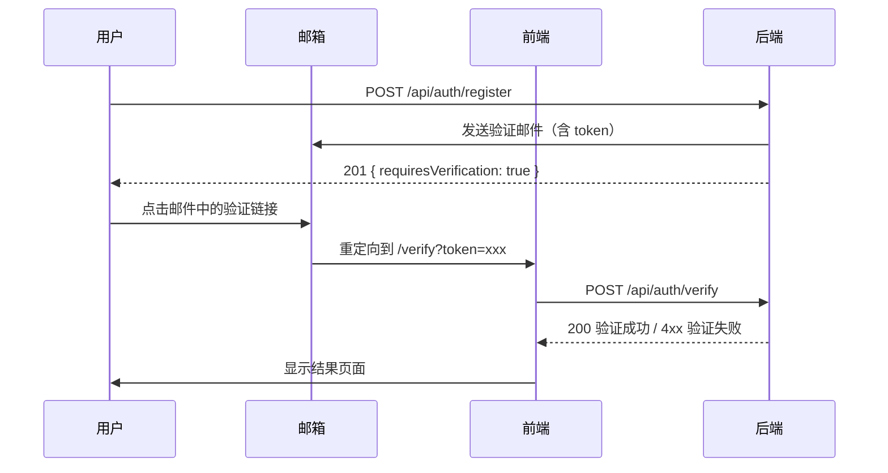

# PROD-11-邮箱验证页前端驱动接口需求（OneCRM）

## 1. 文档目的
- 本文档定义邮箱验证流程所需的后端接口能力。
- 遵循"前端驱动"模式，覆盖用户点击验证链接后的交互逻辑。

## 2. 需求单基础信息
- 需求标题：邮箱验证功能接口定义
- 需求编号：PROD-11
- 提交人（前端）：Agent-Antigravity
- 对应页面：`/verify.html`
- 关联需求：PROD-09（用户注册）

## 3. 页面驱动说明

### 3.1 业务场景
邮箱验证发生在以下场景：
1. **用户注册后**：注册成功返回 `requiresVerification: true`，系统自动发送验证邮件。
2. **重新发送验证邮件**：用户未收到邮件时手动触发重发。

### 3.2 用户交互流


### 3.3 前端路由
- 验证链接格式：`https://app.onecrm.com/verify?token=xxx`
- 前端读取 `token` query 参数后调用后端验证接口。

---

## 4. 接口清单

### 4.1 接口：验证邮箱
- 接口名称：Verify Email
- 方法与路径：`POST /api/auth/verify`
- 调用时机：前端从 URL 读取 token 后自动调用
- 幂等要求：`是`（同一 token 多次验证返回相同结果）
- 超时要求：`3s`

#### 请求定义
- Header：`Content-Type: application/json`
- Body（JSON）：
```json
{
  "token": "eyJhbGciOiJIUzI1NiIsInR5cCI6IkpXVCJ9..."
}
```

#### 字段约束
| 字段 | 必填 | 最大长度 | 说明 |
|------|------|----------|------|
| `token` | 是 | 2048 | 验证令牌（JWT 或加密字符串） |

#### 成功响应 (200 OK)
```json
{
  "status": "success",
  "data": {
    "email": "user@example.com",
    "verifiedAt": "2026-02-09T12:00:00Z"
  }
}
```

#### 错误响应
| HTTP 状态码 | 业务码 | 说明 | 前端处理 |
|---|---|---|---|
| 400 | `AUTH_VERIFY_TOKEN_MISSING` | token 参数缺失 | 显示错误页 |
| 400 | `AUTH_VERIFY_TOKEN_INVALID` | token 格式无效或已被篡改 | 显示错误页 |
| 400 | `AUTH_VERIFY_TOKEN_EXPIRED` | token 已过期 | 显示过期页 + 重发按钮 |
| 400 | `AUTH_VERIFY_ALREADY_VERIFIED` | 邮箱已验证 | 显示已验证提示 |
| 500 | `SYS_INTERNAL_ERROR` | 系统错误 | 显示错误页 |

---

### 4.2 接口：重新发送验证邮件
- 接口名称：Resend Verification Email
- 方法与路径：`POST /api/auth/verify/resend`
- 调用时机：用户点击"重新发送"按钮时
- 幂等要求：`否`
- 超时要求：`5s`（涉及邮件发送）

#### 请求定义
- Header：`Content-Type: application/json`
- Body（JSON）：
```json
{
  "email": "user@example.com"
}
```

#### 字段约束
| 字段 | 必填 | 最大长度 | 规则 |
|------|------|----------|------|
| `email` | 是 | 255 | RFC 5322 格式，前后 trim + 小写化 |

#### 成功响应 (200 OK)
> **安全策略**：无论邮箱是否存在/已验证，均返回相同响应（防枚举）。

```json
{
  "status": "success",
  "data": null
}
```

#### 错误响应
| HTTP 状态码 | 业务码 | 说明 | 是否可重试 |
|---|---|---|---|
| 400 | `AUTH_EMAIL_REQUIRED` | email 参数缺失 | 是 |
| 400 | `AUTH_EMAIL_INVALID` | 邮箱格式无效 | 是 |
| 429 | `AUTH_VERIFY_RATE_LIMITED` | 发送过于频繁 | 否 |
| 500 | `SYS_INTERNAL_ERROR` | 系统错误 | 是 |

**429 响应体结构**：
```json
{
  "status": "error",
  "error_code": "AUTH_VERIFY_RATE_LIMITED",
  "message": "AUTH_VERIFY_RATE_LIMITED",
  "retryAfterSeconds": 60
}
```

---

### 4.3 接口：查询验证状态（可选）
- 接口名称：Check Verification Status
- 方法与路径：`GET /api/auth/verify/status`
- 调用时机：登录时检查用户是否已验证邮箱
- 幂等要求：`是`
- 鉴权要求：`Authorization: Bearer {accessToken}`

#### 成功响应 (200 OK)
```json
{
  "status": "success",
  "data": {
    "email": "user@example.com",
    "verified": true,
    "verifiedAt": "2026-02-09T12:00:00Z"
  }
}
```

---

## 5. 权限与安全

### 5.1 鉴权方式
| 接口 | 鉴权 |
|------|------|
| POST /api/auth/verify | 公开接口（token 自带身份） |
| POST /api/auth/verify/resend | 公开接口 |
| GET /api/auth/verify/status | 需要 accessToken |

### 5.2 Token 规范
| 属性 | 要求 |
|------|------|
| 格式 | JWT 或加密字符串 |
| 有效期 | 24 小时 |
| 单次使用 | 否（幂等，可多次验证） |
| 防篡改 | HMAC-SHA256 签名 |

### 5.3 限流策略
| 接口 | 限制 | 429 错误码 |
|------|------|------------|
| 验证邮箱 | 单 token 每分钟 10 次 | 无（幂等返回成功） |
| 重发验证 | 单 IP 每小时 5 次 | `AUTH_VERIFY_RATE_LIMITED` |

### 5.4 审计要求
| 字段 | 记录方式 |
|------|----------|
| `email_hash` | SHA-256 哈希 |
| `client_ip` | 原文 |
| `action` | verify / resend |
| `status` | success / error |
| `timestamp` | ISO8601 |

---

## 6. 验收标准
1. Given 有效 token, When 验证邮箱, Then 返回 200 和 verifiedAt。
2. Given 过期 token, When 验证邮箱, Then 返回 400 AUTH_VERIFY_TOKEN_EXPIRED。
3. Given 已验证邮箱, When 再次验证, Then 返回 200（幂等）或 400 AUTH_VERIFY_ALREADY_VERIFIED。
4. Given 任意邮箱, When 请求重发, Then 返回 200（防枚举）。
5. Given 频繁重发请求, When 超过限制, Then 返回 429 并包含 retryAfterSeconds。
6. Given 已登录用户, When 查询验证状态, Then 返回当前验证状态。
